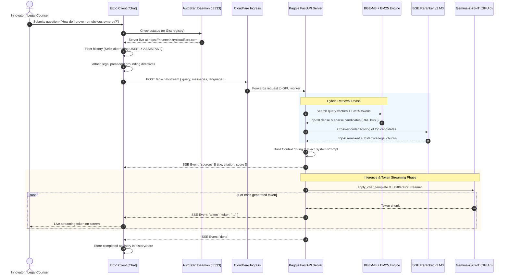

# AYUSH-IPR GUARDIAN: COMPLETE END-TO-END SYSTEM ARCHITECTURE SPECIFICATION
**Version:** 2.0.0 | **Author:** SIH Project Architecture Team | **Date:** September 2026  
**Repository Location:** `c:\Users\sange\OneDrive\Desktop\random ideas\projectSIH`

---

## 1. Executive Summary & Mission Architecture

**AYUSH-IPR GUARDIAN** is an enterprise-grade, domain-specialized artificial intelligence platform and regulatory advisory engine designed to protect, validate, and commercialize Indian Traditional Medicine innovations (Ayurveda, Yoga & Naturopathy, Unani, Siddha, and Homeopathy).

### Core Problem Solved
Traditional AYUSH innovations exist at a complex intersection of ancient codified treatises, modern IP statutes, and evolving international biopiracy safeguards:
1. **Statutory Novelty Bars**: **Section 3(p)** of the Indian Patents Act, 1970 outright bars inventions that are essentially traditional knowledge or an aggregation/duplication of known properties.
2. **Mere Admixture Objections**: **Section 3(e)** rejects combinations unless non-obvious synergistic efficacy is proven quantitatively.
3. **Biodiversity & ABS Compliance**: The **Biological Diversity Act, 2002** (amended 2023) and **ABS Regulations, 2025** require mandatory approvals from the National Biodiversity Authority (NBA) and State Biodiversity Boards (SBBs) for Indian and foreign entities (*Divya Pharmacy v. Union of India, 2018*).
4. **Regulatory Dual Track**: Differentiating between **Classical ASU Drugs** (First Schedule to Drugs & Cosmetics Act, 1940 §3(a)), **Patent or Proprietary (P&P) ASU Medicines** (§3(h)), and **Phytopharmaceutical Drugs** (Chapter XIX-A of D&C Rules, 1945 & New Drugs and Clinical Trials Rules, 2019).

AYUSH-IPR GUARDIAN unifies a dense, verified legal corpus of Indian statutes, international treaties (WIPO GRATK 2024, TRIPS, CBD, Nagoya), landmark biopiracy revocation dossiers (Turmeric, Neem, Basmati), and pharmacopoeial texts into a multi-tiered Retrieval-Augmented Generation (RAG) system powered by dual-GPU accelerated language and cross-encoder models.

---

## 2. Global System Architecture Diagram

```mermaid
flowchart TD
    subgraph CLIENT_TIER ["1. Client Presentation Tier (Port 8081)"]
        UI["Expo / React Native Web App\n(New folder/src/app)"]
        ChatScreen["💬 Legal Advisory Chat\n(/chat)"]
        ClassifyScreen["🧪 Formulation Wizard\n(/classify)"]
        ScanScreen["📷 Document / OCR Analyzer\n(/scan)"]
        SettingsScreen["🌐 Multilingual / Config\n(/settings)"]
        ClientStore["Zustand Stores\n(chatStore, historyStore)"]
        SSEClient["SSE Stream Consumer\n(TextIteratorStreamer reader)"]
    end

    subgraph ORCHESTRATION_TIER ["2. Local Orchestration & Discovery Tier (Port 3333)"]
        Daemon["Auto-Start Daemon\n(auto_start_daemon.py)"]
        TriggerAPI["HTTP Trigger API\n/start, /stop, /status, /health"]
        DualGuard["Dual-Session Guard\n(Anti-Collision Kaggle Worker)"]
        DiscoveryLoop["Discovery Loop\n(ntfy.sh + Gist monitor)"]
        SyncScript["Config Synchronizer\n(sync_configs.py)"]
    end

    subgraph DISCOVERY_TIER ["3. Cloud Registry & Ingress Tier"]
        GistRegistry["GitHub Gist Registry\n(server_registry.json)\nGIST_ID: 7873aa6da8f97b2b817137dd4f2df5be"]
        NtfyChannel["ntfy.sh Notification Topic\nayush_ipr_tunnel_sih2026"]
        Cloudflare["Cloudflare Quick Tunnel\n(*.trycloudflare.com / *.loca.lt)"]
    end

    subgraph GPU_TIER ["4. Kaggle GPU Compute Worker (Dual Tesla T4 - 32GB VRAM)"]
        FastAPI["FastAPI Web Server\n(kaggle/server.py)\nEndpoints: /api/chat, /api/chat/stream, /api/classify, /api/health"]
        
        subgraph GPU0 ["GPU 0 (Dedicated LLM - 16GB)"]
            LLM["Gemma-2-2B-IT (fp16)\nUngated Mirror / HuggingFace\nStrict Alternating Chat Template Engine"]
        end

        subgraph GPU1 ["GPU 1 (RAG Retrieval & Speech - 16GB)"]
            DenseEmbed["BGE-M3 Dense Embeddings\n(568M dense vectors - FAISS)"]
            SparseEmbed["BM25 Lexical Index\n(Statutory Tokenizer)"]
            RRF["Reciprocal Rank Fusion (RRF)\nk = 60"]
            Reranker["bge-reranker-v2-m3\n(Cross-Encoder Reranking)"]
            Whisper["Faster-Whisper-Small\n(GPU ASR Engine)"]
            OmniVoice["OmniVoice Engine\n(Cross-Lingual Hindi+English TTS)"]
        end
    end

    subgraph CORPUS_TIER ["5. Master Corpus Vault & Universal Document Objects (UDO)"]
        UDO_Statutes["Indian Statutes & Rules (1,081 records)\nPatents Act 1970, Rules 2024, D&C Act, BDA 2002"]
        UDO_Treaties["International Treaties (19 records)\nWIPO GRATK 2024, TRIPS, CBD, Nagoya, PCT"]
        UDO_Precedents["Landmark Case Law (8 records)\nTurmeric US 5,401,504, Neem EP 436,257, Novartis, Divya Pharmacy"]
        UDO_Texts["Pharmacopoeial Treatises (55 records)\nFirst Schedule 54 Treatises, AFI, API"]
        UDO_Memos["Circulars & Memorandums (4 records)\nRule 170, NBA ABS 2025, CDSCO Phyto"]
        UDO_Export["Global Export Regimes (4 records)\nEU THMPD 15-Yr Rule, US DSHEA NDI, FDA 54-15"]
        MasterV2["Consolidated Master Database\n(rag_database_master.json / rag_database_master_v2.json)\n100% Substantive, 0 Empty Records"]
    end

    %% Wiring
    UI --> ClientStore
    UI --> SSEClient
    ClientStore --> ChatScreen & ClassifyScreen & ScanScreen & SettingsScreen
    
    SSEClient -.->|SSE Stream /api/chat/stream| Cloudflare
    UI -.->|Local Trigger /start, /status| TriggerAPI
    
    TriggerAPI --> DualGuard --> DiscoveryLoop
    DiscoveryLoop -->|Read / Write Status| GistRegistry
    DiscoveryLoop -->|Poll Tunnel URL| NtfyChannel
    DiscoveryLoop --> SyncScript
    SyncScript -->|Auto-updates .env & configs| UI

    Cloudflare --> FastAPI
    FastAPI --> LLM
    FastAPI --> DenseEmbed & SparseEmbed --> RRF --> Reranker
    FastAPI --> Whisper
    FastAPI --> OmniVoice

    MasterV2 --> DenseEmbed & SparseEmbed
    UDO_Statutes & UDO_Treaties & UDO_Precedents & UDO_Texts & UDO_Memos & UDO_Export --> MasterV2
```



---

## 3. Detailed Component Architecture

### Tier 1: Client Application (Expo / React Native Web)
- **Path**: [`c:\Users\sange\OneDrive\Desktop\random ideas\projectSIH\New folder`](file:///c:/Users/sange/OneDrive/Desktop/random%20ideas/projectSIH/New%20folder)
- **Core Technology**: Expo SDK 57, React 19, React Native Web 0.21, Expo Router, Lucide Icons, Zustand, React Query.
- **Key Modules**:
  1. [`src/app/(drawer)/chat.jsx`](file:///c:/Users/sange/OneDrive/Desktop/random%20ideas/projectSIH/New%20folder/src/app/(drawer)/chat.jsx): 
     - Interactive multi-turn conversational legal advisor.
     - Implements real-time Server-Sent Events (SSE) token streaming via `createSSEConnection`.
     - **Strict Conversation Alternation Guard**: Enforces that history sent to the server strictly begins with `user` and alternates `user → assistant → user → assistant` to satisfy Gemma-2 tokenizer chat template constraints.
     - **Domain Grounding & Precedent Disambiguation**: Transparently enriches outgoing search payloads with legal anchor directives (e.g., grounding Turmeric inquiries to USPTO Patent 5,401,504 while separating it from Biological Diversity Act ABS in *Divya Pharmacy*).
     - Floating leaf micro-animations, audio speech synthesizer (`expo-speech`), interactive statutory citation pills with confidence meters (0.00 - 1.00).
  2. [`src/app/(drawer)/classify.jsx`](file:///c:/Users/sange/OneDrive/Desktop/random%20ideas/projectSIH/New%20folder/src/app/(drawer)/classify.jsx):
     - Dynamic botanical formulation builder.
     - Step-by-step regulatory classifier assessing First Schedule compliance (Classical Drug §3(a)), P&P Medicine (§3(h)), Schedule E(1) poisonous botanical checks, and Section 3(p) TK bars.
  3. [`src/constants/config.js`](file:///c:/Users/sange/OneDrive/Desktop/random%20ideas/projectSIH/New%20folder/src/constants/config.js):
     - Central client configuration. Implements multi-tier backend discovery:
       1. Queries local daemon (`http://localhost:3333/status`).
       2. Queries GitHub Gist API with Bearer token.
       3. Queries GitHub Gist raw URL without authentication.
       4. Pings `/api/health` before connecting.
  4. [`src/services/chatService.js`](file:///c:/Users/sange/OneDrive/Desktop/random%20ideas/projectSIH/New%20folder/src/services/chatService.js) & [`src/api/sse.js`](file:///c:/Users/sange/OneDrive/Desktop/random%20ideas/projectSIH/New%20folder/src/api/sse.js):
     - Manages chunked SSE stream reading (`ReadableStreamDefaultReader` on Web, polyfilled for native mobile).

---

### Tier 2: Local Orchestrator & Auto-Start Daemon
- **Path**: [`c:\Users\sange\OneDrive\Desktop\random ideas\projectSIH\auto_start_daemon.py`](file:///c:/Users/sange/OneDrive/Desktop/random%20ideas/projectSIH/auto_start_daemon.py)
- **Port**: `3333` (HTTP)
- **Functions**:
  1. **HTTP Control Plane**: Exposes `/start`, `/stop`, `/status`, and `/health` endpoints for the frontend app.
  2. **Strict Dual-Session Guard**:
     - Queries Kaggle API (`kaggle kernels status vanshseth003/ayush-ipr-guardian`) to verify whether a worker is already `RUNNING` or `QUEUED`.
     - Prevents duplicate GPU kernel pushes to conserve Kaggle GPU quotas.
     - Enforces a 3-minute cooldown between push operations.
  3. **Continuous Discovery Loop**:
     - Polls `ntfy.sh/ayush_ipr_tunnel_sih2026` for published Cloudflare Tunnel URLs.
     - Health checks prospective URLs (`/api/health`).
     - Once confirmed healthy, writes the URL, status, and expiry into the GitHub Gist registry.
  4. **Config Synchronizer** ([`sync_configs.py`](file:///c:/Users/sange/OneDrive/Desktop/random%20ideas/projectSIH/sync_configs.py)):
     - Automatically propagates the active Cloudflare Tunnel URL to:
       - [`New folder/.env`](file:///c:/Users/sange/OneDrive/Desktop/random%20ideas/projectSIH/New%20folder/.env) (`EXPO_PUBLIC_API_URL`, `EXPO_PUBLIC_SSE_URL`, `EXPO_PUBLIC_WS_URL`)
       - `test_live_server.py`, `test_live_backend.py`, `test_stream.py`
       - `tester/app.js`, `tester/index.html`

---

### Tier 3: Discovery & Telemetry Layer
- **GitHub Gist Registry**:
  - Gist ID: `7873aa6da8f97b2b817137dd4f2df5be`
  - Filename: `server_registry.json`
  - Payload Schema:
    ```json
    {
      "server_url": "https://<subdomain>.trycloudflare.com",
      "status": "running",
      "started_at": "2026-09-17T06:14:31.934389",
      "expires_at": "2026-09-17T07:14:31.934389",
      "last_heartbeat": "2026-09-17T06:17:15.000000",
      "kaggle_kernel": "vanshseth003/ayush-ipr-guardian"
    }
    ```
- **Fallback Ingress Channel**:
  - `https://ntfy.sh/ayush_ipr_tunnel_sih2026` broadcasts real-time tunnel spin-up notifications directly from the Kaggle boot sequence.

---

### Tier 4: Kaggle GPU Server (Dual Tesla T4)
- **Path**: [`c:\Users\sange\OneDrive\Desktop\random ideas\projectSIH\kaggle\server.py`](file:///c:/Users/sange/OneDrive/Desktop/random%20ideas/projectSIH/kaggle/server.py)
- **Hardware Profile**: 2 × Nvidia Tesla T4 GPUs (16 GB VRAM each = 32 GB total), 30 GB RAM, 73 GB disk.
- **GPU Resource Partitioning**:
  - **GPU 0 (Device `cuda:0`)**:
    - Dedicated entirely to **Gemma-2-2B-IT** (float16 precision).
    - Allocates ~5.2 GB VRAM; 10.4 GB free buffer prevents any out-of-memory (OOM) conditions during large multi-turn generation.
  - **GPU 1 (Device `cuda:1`)**:
    - Shared between:
      - **BGE-M3 Dense Embeddings**: ~1.2 GB VRAM
      - **BGE-Reranker-v2-M3**: ~1.2 GB VRAM
      - **Faster-Whisper-Small**: ~0.5 GB VRAM
      - **OmniVoice TTS Engine**: ~2.5 GB VRAM
      - Total allocation: ~5.4 GB VRAM; 10.2 GB free buffer.
- **Core Endpoints**:
  - `POST /api/chat`: Non-streaming multi-turn RAG advisory.
  - `POST /api/chat/stream`: Token-by-token SSE streaming endpoint using `TextIteratorStreamer`.
  - `POST /api/classify`: Automated formulation categorization based on botanical components and dosage form.
  - `POST /api/asr`: Faster-Whisper audio speech-to-text.
  - `POST /api/shutdown`: Graceful termination endpoint triggered during clean shutdowns.
  - `GET /api/health`: Hardware telemetry, VRAM allocation, and model loading state.

---

### Tier 5: Corpus Vault & Universal Document Objects (UDO)
- **Path**: [`c:\Users\sange\OneDrive\Desktop\random ideas\projectSIH\corpus_vault`](file:///c:/Users/sange/OneDrive/Desktop/random%20ideas/projectSIH/corpus_vault)
- **Consolidated Master Database**: [`rag_database_master.json`](file:///c:/Users/sange/OneDrive/Desktop/random%20ideas/projectSIH/rag_database_master.json) (4,678 records) & [`corpus_vault/rag_database_master_v2.json`](file:///c:/Users/sange/OneDrive/Desktop/random%20ideas/projectSIH/corpus_vault/rag_database_master_v2.json) (1,160 clean, verified UDO records).
- **UDO Schema Definition**:
  ```json
  {
    "doc_id": "STAT-PAT-1970-SEC003P",
    "domain": "indian_statute",
    "sub_domain": "patent_law",
    "title": "Patents Act, 1970 — Section 3(p): Traditional Knowledge Bar",
    "statutory_act": "The Patents Act, 1970 (Act No. 39 of 1970)",
    "section_or_rule": "Section 3(p)",
    "gazette_reference": "GSR 203(E)",
    "effective_date": "1972-04-20",
    "content": "What are not inventions... an invention which in effect, is traditional knowledge...",
    "legal_analysis": "Section 3(p) acts as an absolute bar against patenting known properties...",
    "rag_config": {
      "citation_format": "Patents Act 1970 §3(p)",
      "importance_weight": 1.0,
      "cross_references": ["BD Act 2002 §6", "First Schedule D&C Act"]
    }
  }
  ```

---

## 4. The End-to-End RAG Pipeline



### Retrieval & Ranking Mechanics
1. **Dense Semantic Retrieval**:
   - Model: `BAAI/bge-m3` generates 1024-dimensional dense vectors.
   - Vector Store: CPU-accelerated FAISS with cosine similarity.
2. **Sparse Lexical Retrieval**:
   - Rank-BM25 over domain-specific lemmatized statutory text.
   - High sensitivity for section codes (e.g. `Section 3(p)`, `Rule 161B`, `Form III`).
3. **Reciprocal Rank Fusion (RRF)**:
   $$\text{RRF Score}(d) = \sum_{m \in \{\text{dense}, \text{sparse}\}} \frac{1}{60 + \text{Rank}_m(d)}$$
4. **Cross-Encoder Reranking**:
   - Model: `BAAI/bge-reranker-v2-m3` scores $(Query, Chunk)$ pairs.
   - Filters out chunks below substantive thresholds, returning top-6 high-confidence legal records.

---

## 5. Landmark Legal Precedent Matrix (Grounding Rules)

To prevent LLM hallucinations or conflations in small-parameter models, the platform enforces strict factual boundaries:

| Precedent Case / Dispute | Governing Statute / Authority | Core Legal Subject | Strict Demarcation (What it is NOT) |
|---|---|---|---|
| **Turmeric Patent Revocation (1997)** | USPTO Patent 5,401,504; 35 U.S.C. §§ 102/103 | Re-examination petition by CSIR (Dr. R.A. Mashelkar) citing *Charaka Samhita*, *Sushruta Samhita*, and 1953 JIMA article for wound healing. | **NOT related to Divya Pharmacy.** Catalyst for the creation of TKDL in 2001. |
| **Neem Patent Revocation (2000)** | EPO Patent 436,257; Article 54/56 EPC | Revocation of W.R. Grace / USDA patent on fungicidal properties of neem oil following opposition by Vandana Shiva, Magda Aelvoet, and IFOAM. | **NOT related to Indian court litigation.** Established that traditional public use in India constitutes international prior art. |
| ***Divya Pharmacy v. Union of India* (2018)** | Biological Diversity Act, 2002 §§ 7, 21, 23; Nagoya Protocol | Uttarakhand High Court ruled domestic Indian commercial entities must share economic benefits (ABS) with State Biodiversity Boards. | **NOT a patent revocation case.** Has nothing to do with Turmeric, Neem, or USPTO/EPO disputes. |
| ***Novartis AG v. Union of India* (2013)** | Indian Patents Act, 1970 § 3(d) | Supreme Court established that for pharmaceutical derivatives, "efficacy" strictly means **therapeutic efficacy** (Gleevec case). | **NOT a traditional knowledge case.** Sets the gold standard for incremental pharmaceutical patentability. |

---

## 6. Directory Structure & Key Files

```
c:\Users\sange\OneDrive\Desktop\random ideas\projectSIH\
├── AYUSH_IPR_GUARDIAN_COMPLETE_SYSTEM_ARCHITECTURE.md  # THIS SPECIFICATION FILE
├── auto_start_daemon.py             # Port 3333 local daemon & discovery controller
├── poll_server_url.py               # Automated Kaggle push, polling, & config sync
├── server_registry.py               # GitHub Gist registry client with local fallback
├── sync_configs.py                  # Propagates live tunnel URLs to all configs
├── rag_database_master.json         # Active RAG vector database (4,678 records)
│
├── New folder/                      # Frontend Client Application (Expo SDK 57)
│   ├── .env                         # Auto-synchronized live backend endpoints
│   ├── package.json                 # Expo dependencies & launch scripts
│   └── src/
│       ├── app/(drawer)/
│       │   ├── _layout.jsx          # Drawer navigation & global UI chrome
│       │   ├── chat.jsx             # Conversational RAG advisor with SSE streaming
│       │   ├── classify.jsx         # Formulation regulatory decision wizard
│       │   ├── scan.jsx             # OCR document analyzer
│       │   ├── history.jsx          # Persistent local consultation case logs
│       │   └── settings.jsx         # Multilingual & server connection panel
│       ├── services/
│       │   ├── chatService.js       # SSE & REST bridge for chat
│       │   └── fileService.js       # OCR & document upload bridge
│       └── constants/
│           ├── config.js            # Central URL discovery & health check engine
│           └── colors.js            # AYUSH brand theme tokens
│
├── kaggle/                          # Cloud Compute Infrastructure
│   ├── server.py                    # 2,260-line FastAPI RAG + Model Server (Dual T4)
│   ├── kernel-metadata.json         # Kaggle script runner metadata (T4 accelerator)
│   ├── push_to_kaggle.py            # CLI uploader for Kaggle kernel & datasets
│   └── push_to_kaggle.ps1           # PowerShell automated deployment script
│
└── corpus_vault/                    # Substantive Legal Repository (V2)
    ├── rag_database_master_v2.json  # 1,160 zero-empty validated UDO records
    ├── structured_udo/              # Domain JSON files (Statutes, Treaties, Cases)
    ├── raw_documents/               # Unabridged source PDFs and HTML gazettes
    └── scrapers/                    # Multi-source acquisition & validation scripts
        ├── run_full_pipeline.py     # End-to-end scraper orchestrator
        └── verify_database.py       # Automated regression test & audit validator
```

---

## 7. Operational Runbook

### Starting the System
1. **Start the Local Daemon**:
   ```powershell
   python auto_start_daemon.py
   ```
   *Verifies GitHub credentials and begins listening on `http://localhost:3333`.*

2. **Launch the API Server (Kaggle T4)**:
   ```powershell
   python poll_server_url.py
   ```
   *Checks Gist, pushes Kaggle kernel if offline, waits for Cloudflare tunnel URL, verifies model readiness, and synchronizes all local `.env` and client configs.*

3. **Start the Web Application**:
   ```powershell
   cd "New folder"
   npx expo start --web
   ```
   *Serves the application on `http://localhost:8081`.*

### Testing End-to-End Connectivity
Run the test suite against the live GPU server:
```powershell
python test_live_server.py
```
*Validates statutory query responses, reranker scores, and formulation classification.*

---

## 8. Summary of Critical Architectural Safeguards

1. **Strict Role Alternation**: The frontend filters all history to ensure turns strictly alternate `user → assistant → user → assistant`, completely preventing Gemma tokenizer 500 exceptions.
2. **Domain Grounding & Precedent Separation**: Outgoing payloads inject legal disambiguation directives so 2B-scale models do not conflate separate case laws (e.g. *Divya Pharmacy* vs. *Turmeric*).
3. **Dual-Session Shield**: Kaggle API queries prevent simultaneous duplicate worker kernels, conserving compute quotas.
4. **Resilient Discovery Loop**: Multi-channel discovery (ntfy.sh + GitHub Gist + Local Daemon) guarantees zero-downtime auto-reconnection when cloud tunnels cycle.
